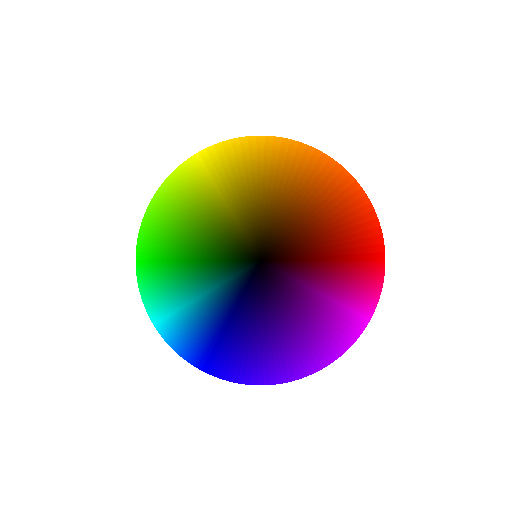
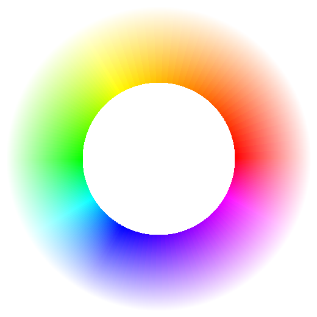
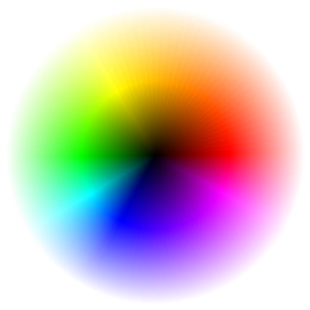

# Color_Wheel_based_on_Brightness

## Baseline
[1]H-V [2]H-S [3]H-SV

[1]</img>
[2]</img>
[3]</img>

## Modified Wheel
### H-V wheel

</img></img>

### H-S wheel

</img></img>

### H-SV wheel

</img></img>

## Further work
- Aliasing
- Error btw secondary colors
